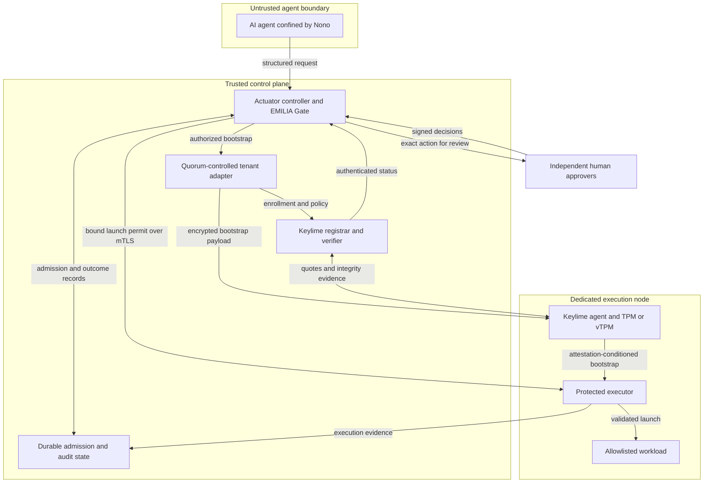

# Design Proposal: Zero Trust Cryptographic Confinement for AI Agents

**EC528 — Demo 1 | Proposed submission: `docs/design-proposal.md` on `demo-1` | Due September 23, 2026, at 12:00 noon**

This is a proposed implementation and evaluation plan, not a report of completed work. Script names below are deliverables to be implemented. Numeric settings are prototype design choices, not measured results or requirements imposed by the sponsor.

## 1. Problem

An AI agent with deployment credentials can turn mistaken or attacker-influenced instructions into real changes to infrastructure. The intended users of this prototype are cloud administrators and engineering teams that want agents to prepare and request workloads without giving those agents independent execution authority.

Existing defenses include restricted credentials, role- or attribute-based access control (RBAC/ABAC), sandboxing, and human approval workflows. These remain necessary. Prompt injection does **not** inherently defeat correctly enforced access control; it can induce an agent to misuse permissions it already has. Our concern is the gap between a permitted API call, human approval of a particular action, and the integrity of the machine that executes it.

We will build an **Actuator Space**: a protected execution path that requires a quorum of administrator signatures for a specific workload request and a recent, policy-compliant Keylime attestation of its target. The agent can compute and prepare requests in its sandbox, but cannot independently deploy workloads to the protected target.

The research question is: **Can we preserve exact-action authorization through attested workload deployment while preventing bypass, request substitution, and duplicate launch attempts under retries and crashes?**

## 2. Proposed design

### 2.1 Scope and component responsibilities

The core demonstration will deploy and run a small, allowlisted checksum workload on one dedicated Linux VM or bare-metal node. It processes a fixed, digest-pinned test input and writes a request-specific result to an executor-controlled output directory. A no-op mode supports latency measurements. We will not accept arbitrary shell strings, install dependencies from mutable network sources during execution, or grant the workload cloud-administration privileges.

| Component | Existing capability we will use | Project-specific implementation |
| --- | --- | --- |
| Nono confinement | OS-level restrictions and credential isolation [1] | A tested agent profile, request adapter, and independent network restrictions that close direct executor, SSH, and cloud-management paths. |
| EMILIA Gate and approval evidence | Exact-action authority checks, signed evidence, and admission/consumption mechanisms on covered paths [2, 3] | A declared workload action, explicit quorum policy, human review interface or CLI, and an adapter to our executor. We will reuse supported Gate mechanisms rather than claim to invent them. |
| Keylime | Registrar, verifier, node agent, tenant management, and TPM-backed measurement verification [4] | Node enrollment policy, trusted reference measurements, verdict/freshness adapter, and a quorum-controlled bootstrap operation. |
| Actuator controller and executor | Standard TLS, signature, and database libraries | Binding approvals to the target and workload, safe artifact staging, durable launch tracking, failure handling, and evidence collection. |

The controller is our integration layer around EMILIA Gate, **not an independent route around it**. Gate will mediate both the credential-owning tenant adapter and workload dispatch path. Any adapter failure or unsupported evidence format will deny release.

#### Authorization policy

Every protected deployment requires two approvals from three separately enrolled administrator identities. Each administrator keeps their private signing credential outside the agent and controller. The controller pins the trusted identity/key mapping; an arbitrary key embedded in a receipt is not automatically trusted [3]. Multiple keys belonging to the same administrator count as one approval.

Here, “multisig” means a policy requiring multiple independently verified signatures, not a new threshold-signature algorithm or blockchain. The 2-of-3 setting is configurable. The reviewed action manifest identifies the protected operation; policy still specifies the approvers, threshold, allowed workload/target, expiry, and attestation requirements even though every deployment requires human approval.

We will verify the selected EMILIA revision's receipt, human-signoff, and quorum interfaces before integration. If threshold composition needs an adapter, we will implement and label that adapter while preserving native signature verification and exact-action binding. We do not assume a ready-made EMILIA-to-Keylime connector.

#### Keylime tenant and bootstrap

The administrators collectively provide authorization; they are **not literally a Keylime software component**. A controller-side service invokes the Keylime tenant interface on their behalf after quorum verification. Tenant credentials and the Keylime control plane remain outside the AI sandbox.

The base node image contains the Keylime agent and a minimal executor. Our intended bootstrap path uses Keylime secure payload delivery to provision a node-specific executor credential/configuration after successful enrollment attestation. Keylime documents encrypted payload provisioning with attestation-conditioned key release; it is not a general-purpose workload scheduler [5]. The approved deployment then transfers the workload through the authenticated executor channel.

The first deployment authorizes both this bootstrap and its workload, with a pinned bootstrap-template digest in the request. These are separately identified stages in the signed manifest, each with its own durable Gate admission record; approving a deployment does not grant reusable tenant authority. Subsequent deployments reuse the enrolled node but still require fresh quorum approval and attestation checks. Demo 2 will verify actual secure-payload support in the pinned agent/server versions; unsupported support is an integration blocker, not permission to substitute an unprotected SSH path.

### 2.2 Architecture and boundaries

There is no permitted agent-to-executor or agent-to-cloud-management path. Deployment credentials, approver keys, and policy files are not mounted into the agent sandbox. If an external model API is needed, only its designated inference endpoint is allowed in addition to the request endpoint. The executor runs workloads under a separate unprivileged identity, without access to its credentials or launch ledger.

### 2.3 Exact-action handoff

The signed request includes a schema version, operation and occurrence ID, submitter, artifact/input/bootstrap digests, executable and argument vector, fixed environment and resource limits, target enrollment identity, authorization-policy version, attestation-policy digests, creation time, and expiry. Server-assigned occurrence IDs remain stable across retries; a new occurrence requires new approvals.

We will use the pinned EMILIA mapping/canonicalization profile and tested serialization across components. Unknown or ambiguous fields are rejected. Approvers see the material fields being signed, not only an agent-written summary.

1. **Prepare and approve.** The controller validates the allowlisted action and freezes its content. Two distinct trusted administrators sign approval evidence bound to that same action. One signature leaves it pending until a second approval or expiry; invalid signatures are rejected without corrupting the original request.
2. **Bootstrap and attest.** After quorum and durable Gate admission for the bootstrap stage, the tenant adapter performs any required bootstrap. An uncertain bootstrap result is reconciled, not blindly repeated. The controller waits for a successful attestation newer than approval and verifies the current node state, pinned enrollment identity, and policy configuration. A past success does not override a subsequent failure. Missing, unreachable, ambiguous, or stale status denies release.
3. **Bind the target.** The enrollment registry binds the node's Keylime identity and attestation key to the executor's authenticated TLS identity and an enrollment epoch. Re-enrollment or a rebuilt node invalidates old permits. An IP address or UUID string alone is insufficient.
4. **Admit once.** Through Gate, the controller durably records admission and a unique permit before dispatch. The permit binds the action digest, executor identity/epoch, attestation reference, and expiry. The initial freshness budget is 30 seconds, with a maximum permit lifetime of 10 seconds capped by both request expiry and the remaining freshness budget. Synchronized clocks with a conservative skew allowance are required; uncertainty fails closed.
5. **Check at launch.** The executor verifies the signature, target, epoch, and expiry and obtains a current controller authorization check before admitting the launch. It validates the artifact and input in executor-owned staging that the agent/workload cannot modify, rejects symlinks, and uses the same verified artifact for launch instead of re-opening an attacker-controlled pathname. Runtime dependencies are pinned in the base image.
6. **Record before starting.** The executor commits the permit to its durable launch ledger before spawning the process. Concurrent or repeated deliveries cannot spawn another process. A crash after consumption but before launch can produce zero executions: this is the deliberate availability cost of **at-most-once launch attempts**, not a guarantee of exactly-once completion.
7. **Report or reconcile.** The controller records the observed result. A lost response or crash with uncertain outcome becomes `INDETERMINATE`; it does not authorize another launch. Recovery queries authenticated executor records. Any remedy requiring another attempt needs a new request and approval.

State transitions are `PENDING_APPROVAL → APPROVED → ATTESTING → ADMITTED → EXECUTING → SUCCEEDED/FAILED`. Pre-admission failures become `DENIED`, `EXPIRED`, or `ATTESTATION_FAILED`. Uncertain post-admission outcomes become `INDETERMINATE` and may be resolved only by evidence, never reset to pending automatically.

### 2.4 Security claims and limitations

Our enforcement claim is conditional on correct controller, executor, kernel, identity enrollment, and durable-state operation. We treat the agent, its context, requests, and submitted artifacts as untrusted; test tampered measured files and incorrect boot state; and tolerate one compromised signer for authorization safety.

- **Attestation is evidence about measured state, not proof of total safety.** Keylime verifies TPM-backed evidence against configured reference policies [4, 6]. A successful quote does not prove application correctness, cover every file or in-memory attack, or guarantee that a node remains unchanged until execution.
- **Evidence freshness is bounded; the attestation-to-use gap is not eliminated.** We record successful-attestation age at launch and reject known failure, but there is still a polling/communication window. Runtime monitoring blocks new admissions after a failure is observed; it cannot undo earlier effects or guarantee that a compromised node obeys a stop command.
- **IMA needs a measurement event.** Changing a file does not necessarily cause an immediate verdict change. Tests deliberately access/execute a harmless modified probe under the configured IMA policy and confirm that its changed measurement appears [6].
- **A VM vTPM does not attest its hypervisor automatically.** Emulated TPM state is controlled by the hosting stack [8]. The provider/hypervisor is trusted in the VM profile; host-TPM-to-guest attestation and confidential-computing/TEE guarantees are outside scope.
- **Container exclusion is scoped.** A standard container is not our independently attested machine boundary. This does not mean host attestation can never measure container-related activity.
- **Exclusions.** A compromised quorum, dishonest approvers, control-plane compromise, fully compromised kernel/executor after a valid quote, rollback/cloning of durable state, and arbitrary denial of service are not solved. A signed result is an attributable executor report, not a cryptographic proof that arbitrary computation was correct.

Reusing an old permit remains forbidden after ordinary process restarts. VM snapshot rollback is excluded; after recovery from a snapshot, operators must revoke the old enrollment epoch and re-enroll before accepting requests.

### 2.5 Design choices and alternatives

| Choice | Selected approach | Rejected alternative and tradeoff |
| --- | --- | --- |
| Human authorization | 2-of-3 distinct signatures for every deployment | Single-signer approval cannot withstand one compromised signer; unanimity loses availability when one signer is absent. |
| Execution boundary | Credential-owning Gate path plus a minimal validating executor | An approval-only UI leaves direct execution paths open. The added boundary increases implementation and testing work. |
| Workload identity | Digest-pinned artifacts/inputs, explicit arguments, fixed runtime | Free-form shell commands and mutable download URLs make approval ambiguous. Our workload support is intentionally narrower. |
| Failure semantics | Durable consumption and at-most-once launch attempts | Blind retry can duplicate effects; our design may require manual reconciliation after a crash. |
| Initial deployment | One controller, one node, persistent admission storage | Multi-controller high availability and multi-node scheduling introduce distributed coordination beyond the core experiment. |
| Platform | MOC TPM-capable VM or bare metal; similar infrastructure with mentor approval | Container-only deployment does not satisfy the intended attestation boundary. Local KVM with `swtpm` is a development fallback, not automatically an equivalent final deliverable. |

Python will implement our adapters, executor orchestration, and tests. We will use the supported EMILIA runtime where necessary instead of porting its cryptography. One authoritative Gate admission store and a durable executor ledger will be used, with their exact backend and restart semantics documented. Dependency revisions, trusted policy inputs, and deployment configuration will be pinned.

## 3. What makes this hard

The hardest part is **preserving the same authorization across the transition from human approval to a changing, remotely attested execution node, including failure recovery**.

The three dependencies supply valuable pieces. EMILIA already addresses exact-action admission and uncertain outcomes [2]; Keylime supplies measurement verification [4]; Nono restricts the agent [1]. We are not claiming those mechanisms as new work. The project-specific challenge is making them apply to one concrete deployment without gaps:

- the approved digest must name the artifact and inputs actually launched;
- the approved target must be the same enrollment and authenticated executor that was attested;
- a stale success must not authorize a failed or re-enrolled node;
- approval must govern tenant bootstrap as well as final launch; and
- concurrent requests, service restarts, and lost responses must preserve consumption without pretending that a distributed database update and process launch are atomic.

We will implement this binding and demonstrate its necessity with adversarial tests and isolated weakened-control baselines. The contribution is a tested integration protocol and executable evidence of its guarantees and limits, not a new cryptographic primitive or a claim of unconditional zero trust.

## 4. How you will know it worked

### 4.1 Testbed and baselines

Use one controller host and one dedicated execution node, recording the VM/bare-metal profile, TPM type, OS image, software revisions, policy digests, clock configuration, and network rules.

Two baselines answer different questions:

1. **Performance baseline:** the same workload on the same node through the same authenticated transport/executor, without quorum and attestation gating, in an isolated test configuration.
2. **Security ablations:** separately remove quorum enforcement, attestation gating, or durable replay protection in a disposable testbed. The corresponding negative test should expose the missing protection while the full system blocks it. We will not expose weakened variants to production systems.

Repeatable tests use fixture keys and scripted signatures, explicitly labeled as automation rather than human participation. Demo 3 and the final additionally require two real people to approve from separate credentials, showing the pending request before the second approval. At least one live model-driven request is included; deterministic request replay supports reproducibility if an inference service is unavailable.

### 4.2 Acceptance criteria

“Zero unauthorized launches” means zero observed launches in the defined test suite, not proof against every possible attack. Tests inspect executor process-start records and request-specific output, not merely a gateway error response. Security failures are never counted as acceptable availability failures.

| Property | Experiment | Required result |
| --- | --- | --- |
| Valid operation | 20 clean, valid deployments, with approval and artifact/node identity checks | At least 19 complete correctly; all completed cases match the approved action and target, with one process launch each. Report every failure. |
| Quorum and exact-action binding | 20 attempts per class: no approval, one signer, duplicate identity, untrusted key, expired evidence, changed arguments, artifact, input, target, or policy | Zero unauthorized launches. Insufficient approvals remain pending then expire; invalid or mismatched evidence is rejected. |
| Bootstrap gating | Fresh enrollment with valid quorum/clean state; repeat with missing quorum and with failed attestation | Successful case provisions the executor credential and runs the workload; negative cases do not release a usable bootstrap credential or launch it. |
| Replay, concurrency, and restart | 20 trials each of replay, 10 simultaneous deliveries, controller restart, executor restart, and lost response after launch | At most one launch per permit in every trial; fault-free races launch once. Ambiguous failures retain consumed state and require reconciliation. |
| Attestation and stale status | Five fresh-reset trials each of a measured-boot mismatch and a harmless runtime probe mismatch; 20 trials each of missing/stale status, verifier outage, and old success followed by failure | Evidence confirms the mismatch or unavailable state. After failure is observed, or freshness expires, zero new launch admissions. Record detection delay separately from blocking delay. |
| Artifact and target substitution | 20 trials each replacing the staged artifact, changing the authenticated endpoint, and changing the enrollment epoch | Zero launches with mismatched bytes or identity. |
| Confinement | Scripted attempts from the actual sandbox to read protected credentials and contact executor, SSH, and cloud-management endpoints, including child processes | All enumerated bypass attempts fail; the legitimate request endpoint still works. Publish the tested paths and configuration. |
| Evidence completeness | Check every request and rejected attempt | Records include request/attempt IDs, stage, reason, and applicable receipts, attestation, permit, and outcome. Skipped stages are marked “not reached,” not assigned fabricated evidence. |
| Freshness and performance | 50 paired valid runs with fixture signatures and a pre-provisioned node | Publish median/p95 latency, overhead relative to baseline, successful-attestation age at launch, and failures. No admitted launch exceeds the 30-second evidence-age budget, including the configured clock-skew margin. |

Keylime's verifier API distinguishes current state from the timestamp of its last successful attestation; the adapter must check both rather than treating a status read as a new quote [7]. Our evidence-age metric uses that verifier timestamp, not a claim to know the exact instant every underlying measurement was taken. We will test response behavior near the configured expiry boundary.

Latency reporting separates human waiting, bootstrap/provisioning, attestation waiting, Gate processing, transfer, and workload runtime. Because baseline measurements are not yet available, performance characterization and the explicit freshness limit are the committed deliverables; any additional latency target will need a measured justification and an announced plan revision.

Audit records will be append-only through application permissions on the trusted controller and export verifiable approval evidence. This is not a claim of tamper-proof storage against controller administrators. Logs use an explicit field allowlist: Keylime responses may contain sensitive fields and must not be copied wholesale.

## 5. Milestones

The dates below follow the supplied assignment. Scripts and reports are planned deliverables, run from each demonstration's recorded repository commit with its accompanying instructions. Each script must assert its criteria, return nonzero on failure, and write machine-readable results.

| Demo | Date | Milestone | How we will demonstrate it |
| --- | --- | --- | --- |
| Demo 2 | 10/21 | **Exact-action quorum authorization.** A declared deployment action, pinned trusted identities, configurable 2-of-3 policy, and persistent admission state work with the selected EMILIA revision. | `experiments/demo2_authorization.sh` shows two distinct valid approvals accepted; one signer pending until expiry; duplicate/untrusted signers, changed fields, and expired evidence refused; and consumed authority remaining unavailable after restart. Export verified receipts and `results/demo2-authorization.json`. |
| Demo 2 | 10/21 | **Keylime enrollment and protected bootstrap.** A TPM-capable test node uses an explicit measured-boot policy and IMA runtime policy; quorum-controlled tenant bootstrap works. | `experiments/demo2_attestation.sh` demonstrates clean-node bootstrap, no usable payload release on failed attestation, and a measured runtime-probe mismatch causing failure. Publish version pins, policy files, MOC capability findings, and `results/demo2-attestation.json`. Local KVM is permitted for this integration milestone. |
| Demo 3 | 11/16 | **Bound, restart-safe handoff.** The Gate/controller/executor path binds action, node identity, enrollment epoch, and fresh attestation while enforcing at-most-once launch attempts. | `experiments/demo3_bridge.sh` demonstrates a valid launch and refusal of artifact/target substitution, stale status, replay, and a 10-client race; restart/lost-response cases never produce a second launch. Publish `results/demo3-bridge.json` and reconciliation records. |
| Demo 3 | 11/16 | **Real agent and human-in-the-loop demonstration.** A Nono-confined agent requests deployment; two people sign before tenant/bootstrap or launch authority is exercised. | `experiments/demo3_confinement.sh` records the pending state after one approval, successful deployment after the second and attestation, and blocked direct-access attempts. `tools/verify_evidence.py` checks stage-appropriate evidence. Document the agreed final infrastructure. |
| Final | 12/09 | **Reproducible full evaluation on MOC or an explicitly agreed similar platform.** All Section 4 criteria are exercised, with no observed unauthorized/duplicate launches. | `experiments/final_evaluation.sh` generates `results/final-summary.json`, raw trial data, baseline/ablation comparisons, and a limitations report. Demonstrate a valid live request, an unauthorized request derived from a prompt-injection scenario, attestation failure, and replay rejection. Publish setup instructions that reproduce deployment from a clean image. |

By October 2, we will record an internal compatibility checkpoint covering MOC access/TPM support, the EMILIA approval interface, and Keylime payload support. If a blocker changes a committed milestone, we will record the proposed change and justification in the repository and announce it at the next demo, following the supplied progress rules. A local emulator does not silently replace the final MOC-or-similar demonstration.

This proposal addresses the design and technical-challenge components of Demo 1. Slides remain a separate graded deliverable (25% in the supplied rubric); this file does not satisfy that requirement by itself.

## 6. Risks

| Risk | Mitigation and decision |
| --- | --- |
| MOC access, vTPM, or suitable boot measurements are unavailable | Check early; use local KVM with a VM-attached `swtpm` and real guest IMA for development. Seek MOC bare metal or a mentor-approved similar platform. Disclose any reduced trust guarantees or milestone change. |
| EMILIA or Keylime version compatibility blocks approval/bootstrap | Pin tested revisions at the compatibility checkpoint. Build narrow adapters only where necessary; do not weaken signature verification, attestation, or quorum to obtain a demo. Escalate unsupported required functionality. |
| Incorrect reference policies accept tampering or reject clean nodes | Generate policies from a trusted clean image; include required executor/runtime components; test both clean and deliberately mismatched states. Do not learn the allowlist from an already suspect node or use “accept all.” |
| Approvers sign a misleading summary or keys are mishandled | Display material signed fields; verify distinct enrolled identities and policy version; keep keys separately controlled. Validate revocation at admission. Quorum approval does not prove that humans understood or wisely approved the action. |
| Time-of-check/time-of-use gaps or stale status | Enforce freshness and permit expiry, recheck before admission, protect staging, and measure detection windows. Do not claim these measures defeat arbitrary post-quote compromise. |
| Restart, ledger loss, or snapshot rollback revives authority | Persist consumption before launch; reject uncertain replays. Treat ledger loss as fail-closed. Snapshot recovery requires revoking the old enrollment epoch, not merely restarting services. |
| Hidden bypass paths or excessive workload privileges | Test network and filesystem restrictions; separate workload and executor identities; keep credentials outside both agent and workload. Reject unlisted actions and avoid arbitrary shell interpretation. |
| Excessive scope or unstable latency targets | Commit to one node and one workload class first. High availability, dynamic fleet scheduling, advanced cryptographic threshold schemes, and whole-system compromise resistance are outside core scope. Report performance before proposing justified new targets. |

## References

Technical sources were consulted on September 22, 2026. These links describe dependencies; proposed integration behavior and test thresholds above are our design choices. The project brief, six-section template, dates, and grading excerpts supplied with the assignment are the source of course requirements. The linked course pages were not retrievable during this review, so no additional unpublished rubric requirements are assumed.

1. [Nono — sandbox and credential-isolation overview](https://nono.sh/).
2. [EMILIA Protocol — repository, Gate boundaries, and admission semantics](https://github.com/emiliaprotocol/emilia-protocol).
3. [EMILIA — signature verification and independently supplied trust anchors](https://www.emiliaprotocol.ai/verify).
4. [Keylime — remote attestation and component roles](https://keylime.dev/blog/2024/02/07/remote-attestation-blog-part1.html).
5. [Keylime — Secure Payloads](https://keylime.readthedocs.io/en/latest/user_guide/secure_payload.html). The page is marked incomplete; selected-version behavior must be tested.
6. [Keylime — Runtime Integrity Monitoring](https://keylime.readthedocs.io/en/latest/user_guide/runtime_ima.html).
7. [Keylime — Verifier API v2.4](https://keylime.readthedocs.io/en/latest/rest_apis/2_4/verifier.html).
8. [OpenStack Nova — Emulated Trusted Platform Module](https://docs.openstack.org/nova/latest/admin/emulated-tpm.html).
9. [Mass Open Cloud Alliance](https://massopen.cloud/). Project access and TPM-enabled resources remain unverified.
10. [EC528 Fall 2026 grading policy](https://ec528.github.io/ec528/fall26/grading/) and [proposal template](https://github.com/ec528-fall26/zero-trust/blob/main/docs/design-proposal.md), as reproduced in the assignment supplied for this proposal.